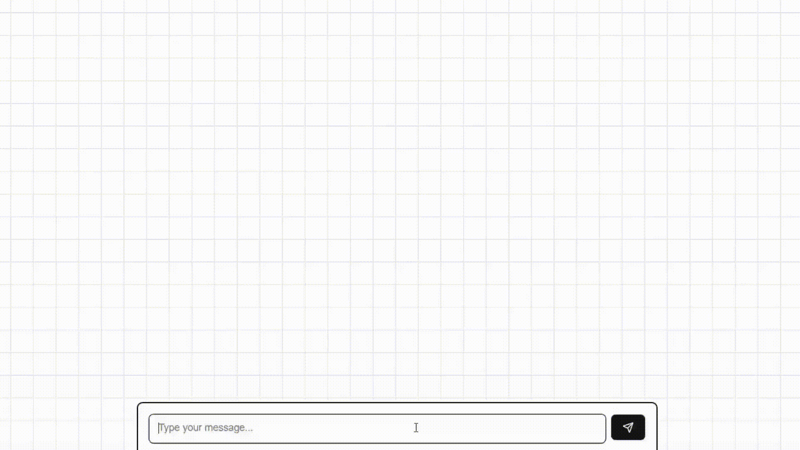

# StudAIng

**StudAIng** is a web application that helps students to study more effectively using AI. It can create Flashcards, Quizzes, Visualization, Presentation for Interactive Learning using AI.


## Features
### Interactive study components

Engage with presentations, flashcards, quizzes, and other interactive components designed to make your learning time more efficient.


### Advanced AI canvas
Create, draw, and illustrate complex problems for StudAIng to solve and explain.


### Physics Simulator
Experience real-time physics simulations to understand complex concepts through interactive and visual experimentation.


### Spelling Trainer
Learn spelling and pronunciation of words using spelling quizzes and pronunciation guides.



## Technologies used
- React
- Next.js
- OpenAI
- AIML
- AWS S3
- Prisma
- MongoDB

## Installation
1. Clone the repository
2. Install dependencies
```bash
npm install
```
3. Run the development server
```bash
npm run dev
```
5. Create a `.env` file in the root directory and add the following environment variables
```bash
AIML_API_KEY=your-aiml-api-key
OPENAI_API_KEY=your-openai-api-key
DATABASE_URL=your-database-url
NEXTAUTH_URL=http://localhost:3000/
NEXTAUTH_SECRET=your-nextauth-secret

# OAuth Google Provider
GOOGLE_CLIENT_ID=your-google-client-id
GOOGLE_CLIENT_SECRET=your-google-client-secret

# AWS S3 Bucket for file storage
BUCKET=your-bucket-name
AWS_ACCESS_KEY_ID=your-aws-access-key-id
AWS_SECRET_ACCESS_KEY=your-aws-secret-access-key
```
4. Open [http://localhost:3000](http://localhost:3000) with your browser to see the result.

## Contributors
- [Gaurav Phuyal](https://github.com/phuyalgaurav)
- [Manish Bagale](https://github.com/munannoo)


## Contributing
Pull requests are welcome. For major changes, please open an issue first to discuss what you would like to change.

## License
This project is licensed under the MIT License - see the [LICENSE](LICENSE) file for details.
```